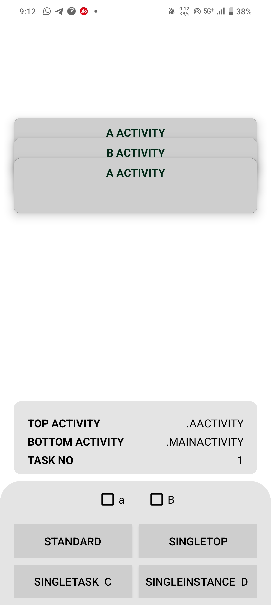
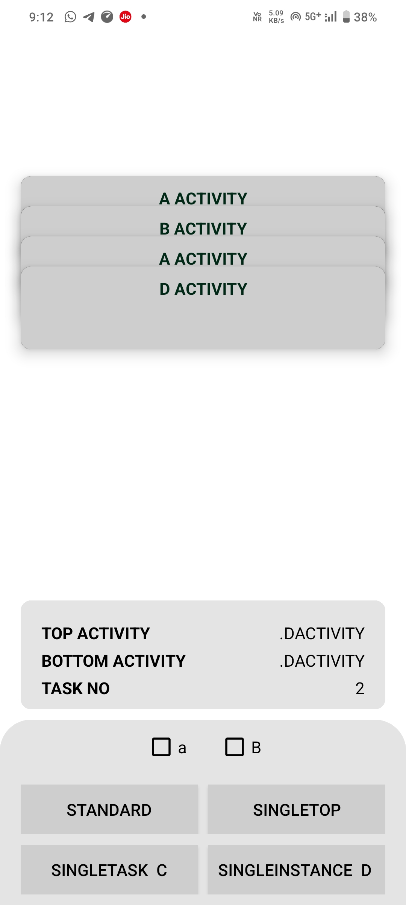

# 🚀🌟 LaunchModes

🚀 Demo Project: Exploring Android Launch Modes

This project is all about understanding the four launch modes in Android:
1️⃣ Standard
2️⃣ SingleTop
3️⃣ SingleTask
4️⃣ SingleInstance

It demonstrates how different activities behave when launched with these modes and various flags. 🧑‍💻✨

Perfect for anyone curious about activity behavior and task management in Android! 👨‍🏫📱

## What are launch modes 

**Launch Modes in Android** 🚀📱 define how activities are launched and behave within the task stack:

✨ **Standard** creates a new instance every time, making it the default behavior.  
🔄 **SingleTop** reuses the existing instance if it’s already on top, optimizing performance.  
🧹 **SingleTask** clears other activities in the task and creates a new instance, great for home screens 🏠.  
🗂️ **SingleInstance** runs the activity in its own task, perfect for exclusive use cases like a video player 🎥.

## Different Screens 📱📲📳

Password Manager  offers a secure, sleek experience with a beautifully crafted interface. Enjoy a smooth and intuitive design across features like All Passwords, Add New Password, Saved Passwords, Password Search, Secure Backup, PIN & Biometric Lock, and more. Dive into a user-friendly, visually appealing journey to securely store, manage, and protect your sensitive information! 🔐✨

<table style="width:100%">
  <tr>
    <th>
 First Task  
 </th>
    <th>
 Second Task 
</th>
  </tr>
  <tr>
    <td>
 
</td>
    <td>
 
</td>
  </tr>

</table>

## About 🔐✨

🚀 **Exploring Android Launch Modes with My Demo Project**

I created a demo project to showcase the behavior of different **launch modes** in Android in a practical way. 📱✨

The app includes four activities: **A, B, C, and D**, each demonstrating how launch modes affect activity behavior and task management. I even added a sneak peek of task structures 🗂️, showing how tasks look under various conditions.

To make it visually appealing, I used a **transparent background** 🌈 (you can refer to my LiveData project for more). The project focuses on the four main launch modes, but did you know there’s a **fifth mode**? 🤔 You can fork this repository and contribute by adding the last mode or exploring the many **intent flags** 🎯.

This project taught me so much about **launch modes** and their practical use cases. I'm sure you'll have fun experimenting with it too! 🌟✨

## video 📺💻

https://github.com/user-attachments/assets/70989c0c-bd0a-4090-a848-672e25d05fb7

**Watch Full Video** 

